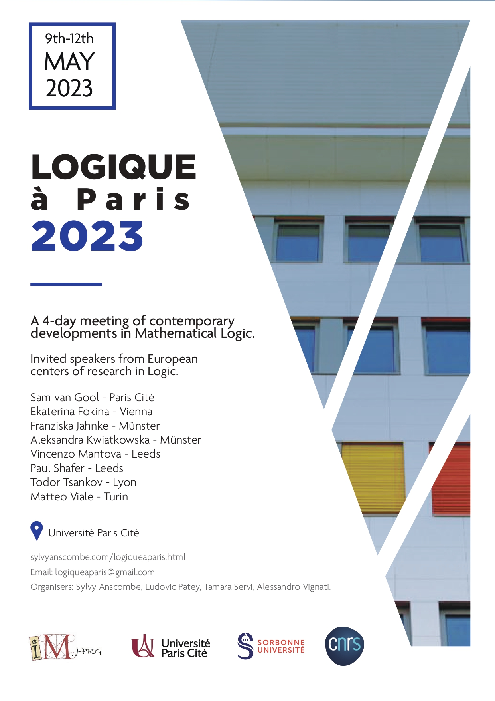

A 4-day meeting of contemporary developments in Mathematical Logic,
with a focus on the themes of interest to the members of the
[Équipe de Logique][LM] in the [Institut de Mathématiques de Jussieu–Paris Rive Gauche][IMJ-PRG].

There will be symposium-type seminars given by seven invited speakers from a range of other European centers of research in Logic.

[\\]: # 

[\\]: # 
[\\]: # <a class="linkdebugmain" href="./logiqueaparis.html">Registration Form</a>

- Registration :
**open soon**
- _Dates_ : 9th--12th May 2023
- _Speakers_ :
_to be confirmed_

[\\]: # 	- Ekaterina Fokina (Vienna)
[\\]: # 	- Franziska Jahnke (Münster)
[\\]: # 	- Aleksandra Kwiatkowska (Münster)
[\\]: # 	- Vincenzo Mantova (Leeds)
[\\]: # 	- Paul Shafer (Leeds)
[\\]: # 	- Todor Tsankov (Lyon)
[\\]: # 	- Matteo Viale (Turin)
- _Location_ : Halle aux Farines, Campus Grandes Moulins, Université Paris Cité, 75013 Paris
- _Organisers_ : 
	- Sylvy Anscombe 
	- Ludovic Patey
	- Tamara Servi
	- Alessandro Vignati
- _Email us_ : [logiqueaparis@gmail.com](logiqueaparis@gmail.com)

<a href="./imj-prg.png">
<a href="./upc.png">
<a href="./sorbonne.png">
<a href="./cnrs.png">

[\\]: # 

[UPC]:  https://u-paris.fr/
[IMJ-PRG]: https://www.imj-prg.fr/
[LM]:   https://www.imj-prg.fr/lm/
